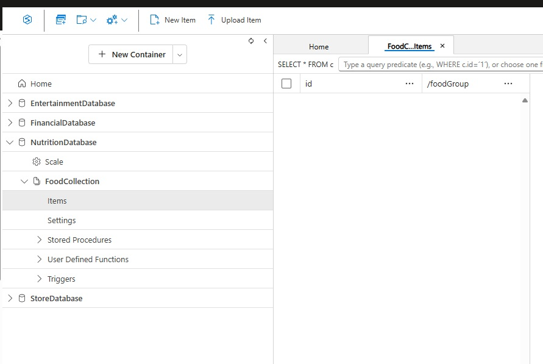
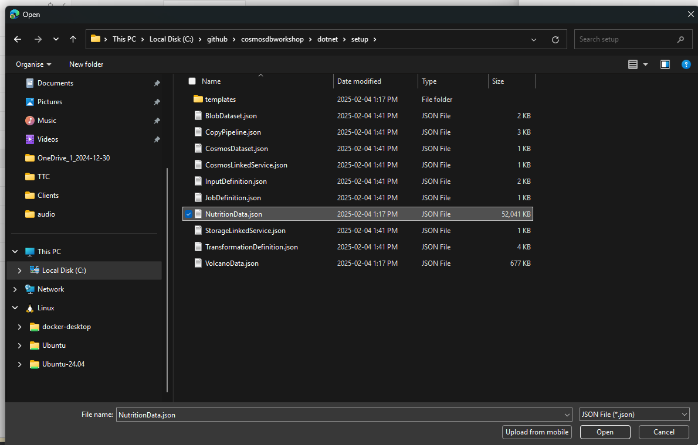
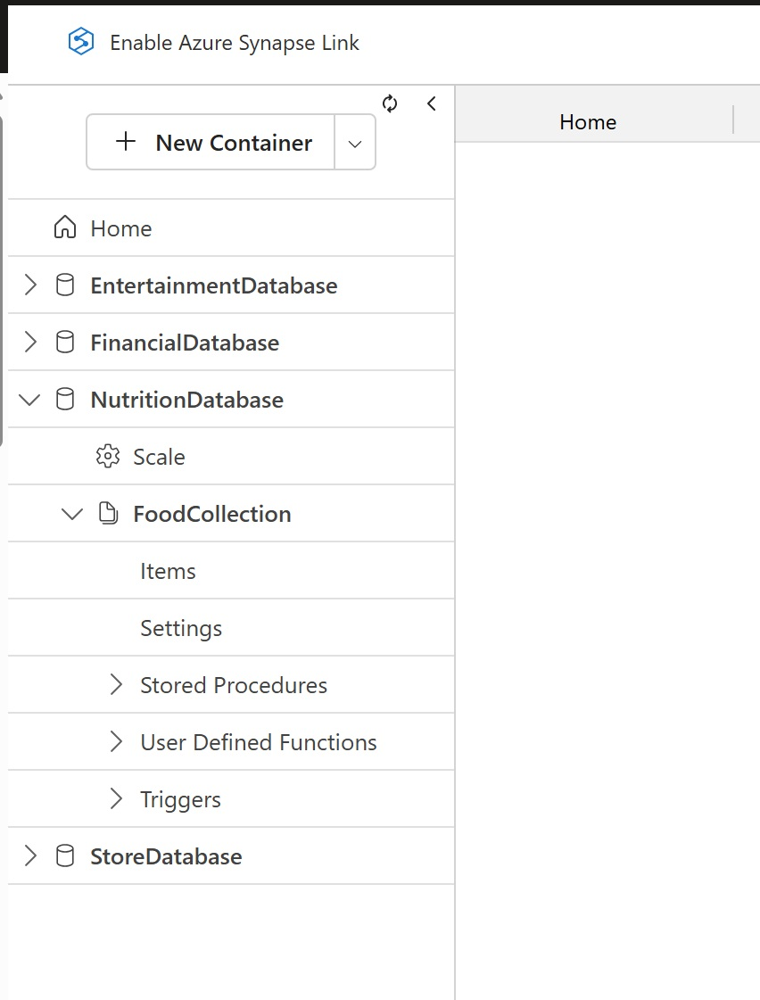
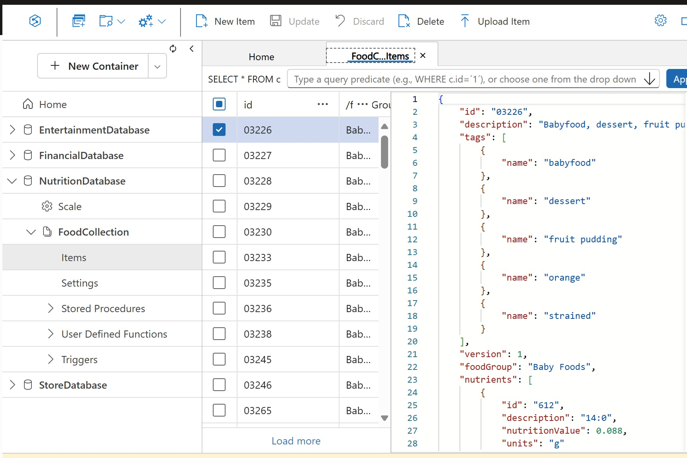

# Load Data Into Cosmos DB with Azure CLI

The Azure Cosmos DB Data Explorer allows you to view documents, import them and run queries directly within the Azure Portal. In this exercise, you will use the Data Explorer to import and view the data stored in our container.

## Import Data

The Azure Cosmos DB Data Explorer allows you to import documents. In this exercise, you will use the Data Explorer to import the data stored in our container.

1. Return to the **Azure Portal** (<http://portal.azure.com>).

1. On the left side of the portal, select the **Resource groups** link.

    

1. In the **Resource groups** blade, locate and select the **cosmoslabs** resource group.

    

1. In the **cosmoslabs** blade, select the **Azure Cosmos DB** account you recently created.

    

1. In the **Azure Cosmos DB** blade, locate and select the **Data Explorer** link on the left side of the blade.  Open the NutritionDatabase, open the **FoodCollection** and click on **Items**.

    

1. Now click on the **Upload Item** button and go where you cloned the repository of the workshop and upload the **NutritionData.json**  and click upload.  It's possible you have some throttling errors, this is normal we are keeping the cost low.

## Validate Imported Data

The Azure Cosmos DB Data Explorer allows you to view documents and run queries directly within the Azure Portal. In this exercise, you will use the Data Explorer to view the data stored in our container.

You will validate that the data was successfully imported into your container using the **Items** view in the **Data Explorer**.

1. Return to the **Azure Portal** (<http://portal.azure.com>).

1. On the left side of the portal, select the **Resource groups** link.

    

1. In the **Resource groups** blade, locate and select the **cosmoslabs** resource group.

    

1. In the **cosmoslabs** blade, select the **Azure Cosmos DB** account you recently created.

    

1. In the **Azure Cosmos DB** blade, locate and select the **Data Explorer** link on the left side of the blade.

    

1. In the **Data Explorer** section, expand the **NutritionDatabase** database node and then expand the **FoodCollection** container node.

    

1. Within the **FoodCollection** node, select the **Items** link to view a subset of the various documents in the container. Select a few of the documents and observe the properties and structure of the documents.

    

